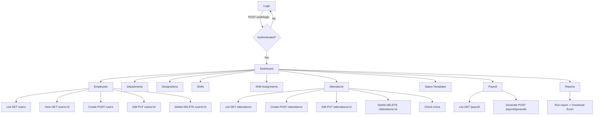
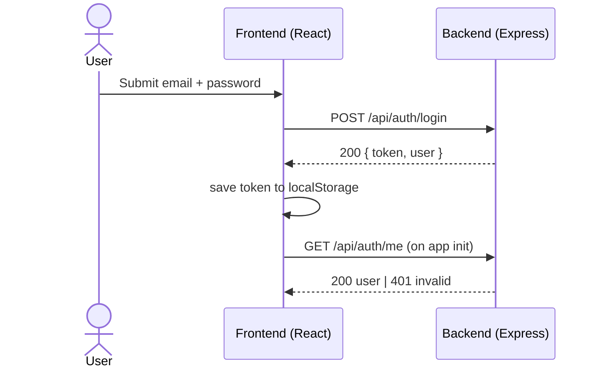
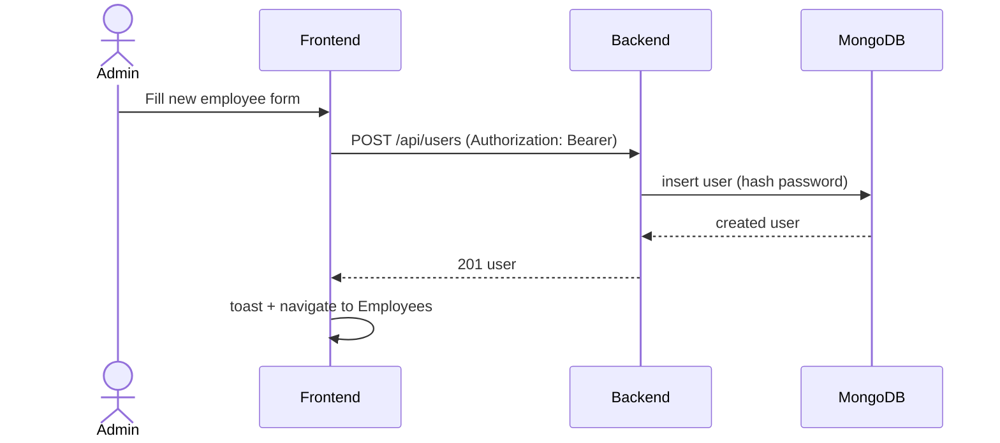
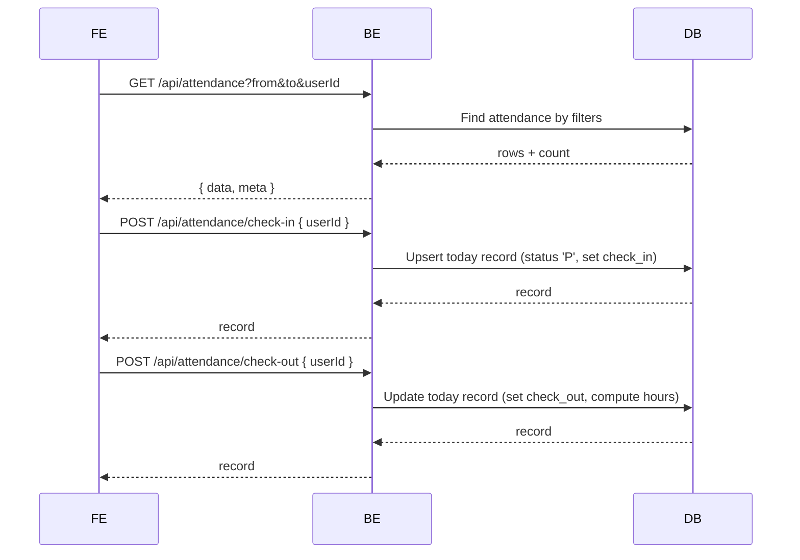
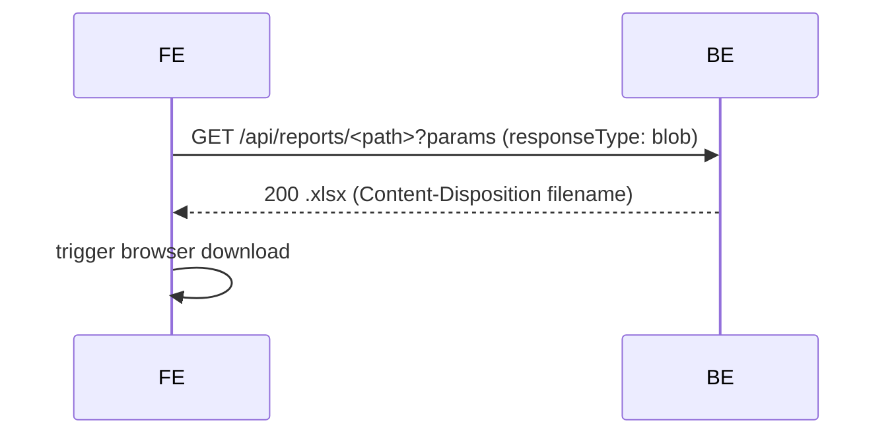

# EMS Project Flow

This document outlines core flows in the EMS application. Diagrams use Mermaid syntax.

## High-Level User Flow

## Authentication Sequence

## Create Employee Sequence

## Attendance Flow (Range & Check-in/Out)

## Reports Flow

